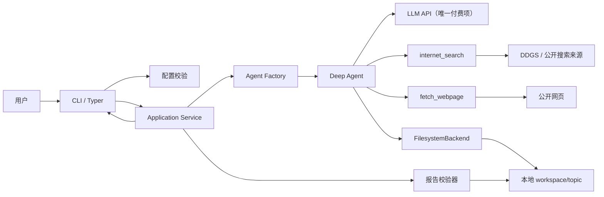
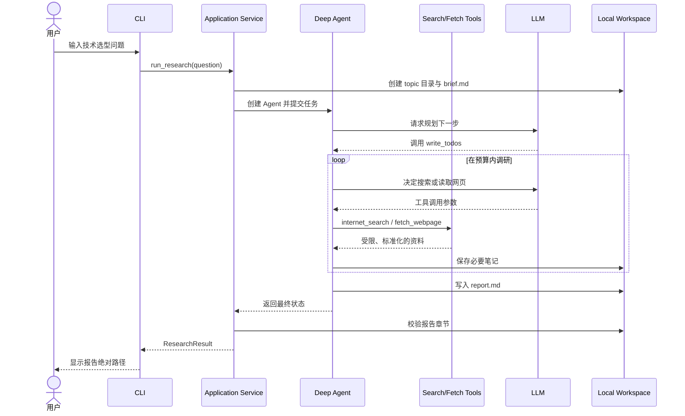

# TechScout MVP 架构设计

## 1. 文档目的

本文定义 TechScout 在 Sprint 0 的最小可行架构，作为编码、测试和验收依据。

MVP 只验证一条核心链路：

> 用户通过命令行输入技术选型问题，Deep Agent 规划调研、免费搜索公开网页，并在本地生成带来源的 Markdown 报告。

架构优先级依次为：

1. 能运行并形成完整闭环。
2. 能观察 Deep Agents 的规划、工具调用和文件操作。
3. 除 LLM Token 外不产生服务费用。
4. 文件和网络访问有明确边界。
5. 结构足够清晰，但不过早建设多代理、数据库或 Web 服务。

## 2. MVP 范围

### 包含

- Python 3.11+ 命令行程序。
- 一个通过 `create_deep_agent` 创建的主 Agent。
- Deep Agents 内置 Todo 规划能力。
- 受限的本地文件系统 Backend。
- `internet_search` 免费搜索工具。
- `fetch_webpage` 受限网页读取工具。
- 本地 `brief.md`、`notes/` 和 `report.md` 产物。
- 配置校验、基础日志、错误提示和自动化测试。

### 不包含

- Web UI 或 HTTP API。
- 多 Agent 和自定义子代理。
- Checkpointer、跨会话恢复和长期记忆。
- Skills。
- 数据库、向量库或云存储。
- LangSmith 云端追踪。
- LocalShellBackend 或 Agent 任意命令执行。
- 付费搜索 API、托管 Agent 和云端 Sandbox。

## 3. 总体架构



应用自身只做编排和边界控制。调研步骤由 Deep Agent 决定，但它只能使用显式授予的工具。

## 4. 分层设计

### 4.1 Interface：CLI 层

职责：

- 接收用户问题和可选 topic 名称。
- 加载配置并展示配置错误。
- 启动一次调研任务。
- 输出关键进度，不打印冗长网页正文。
- 成功后显示报告的绝对路径。
- 失败时返回非零退出码。

建议命令：

```powershell
uv run techscout research "3 人团队开发内部 AI API，FastAPI 和 Django 应该如何选择？"
```

MVP 只保留一个 `research` 命令，避免提前设计复杂命令体系。

### 4.2 Application：用例编排层

核心入口可抽象为：

```python
run_research(question: str, topic: str | None = None) -> ResearchResult
```

职责：

1. 校验问题非空并限制长度。
2. 生成安全且不冲突的 topic slug。
3. 创建本次任务工作目录。
4. 生成确定性的 `brief.md`。
5. 创建 Deep Agent 并传入调研任务。
6. 消费 Agent 流式事件并转成 CLI 进度。
7. 校验 `report.md` 是否存在且章节完整。
8. 返回报告路径和运行摘要。

该层不直接调用搜索引擎，也不包含具体模型 SDK 逻辑。

### 4.3 Agent：决策与调研层

使用 `create_deep_agent` 创建单个 Agent。

Agent 获得以下能力：

- `write_todos`：拆解并维护调研计划。
- `ls`、`read_file`、`write_file`、`edit_file`、`glob`、`grep`：在本次工作区内管理产物。
- `internet_search`：发现候选信息来源。
- `fetch_webpage`：按需读取少量网页正文。

MVP 不提供：

- `execute`：不允许 Agent 在宿主机执行 Shell 命令。
- 自定义子代理：先观察单 Agent 的行为和上下文问题。
- 任意项目目录读写：Agent 只看到本次任务目录。

系统提示词只描述角色、工作流程、报告格式和停止条件。调用次数、路径边界和网络安全必须由代码强制执行，不能依赖提示词。

### 4.4 Tool：联网工具层

#### `internet_search`

接口：

```python
internet_search(query: str, max_results: int = 5) -> SearchResponse
```

实现：

- 通过 DDGS 执行免费元搜索。
- 单次结果数强制限制为 1～5。
- 查询长度设置上限。
- 输出只保留标题、URL 和摘要。
- URL 去重。
- 使用超时并统一转换上游异常。

#### `fetch_webpage`

接口：

```python
fetch_webpage(url: str) -> PageContent
```

实现：

- 只接受 `http`、`https`。
- 拒绝 localhost、私网、链路本地地址和云元数据地址。
- DNS 解析后再次检查目标 IP。
- 限制重定向次数，并校验每个跳转地址。
- 设置连接和读取超时。
- 限制 Content-Type 和最大响应体。
- 用 `markdownify` 将 HTML 转为 Markdown。
- 截断正文，只向 LLM 返回必要内容。

#### 调用预算

MVP 默认：

- 每个任务最多 6 次搜索。
- 每次搜索最多 5 条结果。
- 每个任务最多读取 8 个网页。
- 单个网页返回给 Agent 的正文设置字符上限。
- 同一次运行中的相同查询和 URL 使用内存缓存。

预算由工具包装器计数，达到上限时返回明确错误，防止 Agent 循环搜索并浪费 Token。

### 4.5 Infrastructure：模型、文件和配置层

#### 模型

- 通过 `langchain-openai` 接入支持工具调用的模型。
- 模型名由 `MODEL_NAME` 配置，不写死在业务代码中。
- API Key 只从环境变量读取。
- 不使用模型供应商内置的付费 Web Search 工具。
- LLM 调用是整个项目唯一允许产生的第三方费用。

#### 文件 Backend

MVP 使用：

```python
FilesystemBackend(
    root_dir=absolute_topic_workspace,
    virtual_mode=True,
)
```

设计理由：

- 报告需要在进程退出后保留，默认的 `StateBackend` 不合适。
- `FilesystemBackend` 能直接产生用户可查看的 Markdown 文件。
- `virtual_mode=True` 阻止 `..`、`~` 和越过 root 的绝对路径。
- root 指向单个任务目录，而不是仓库根目录，Agent 无法通过文件工具读取源码和 `.env`。
- 不使用 `LocalShellBackend`，避免提供不受隔离的宿主机命令执行。

`virtual_mode=True` 是路径防护，不是操作系统级 Sandbox。MVP 没有 Shell 工具，因此可以把风险限制在文件工具和自定义网络工具的边界内。

#### 配置

配置对象建议包含：

```text
MODEL_NAME
OPENAI_API_KEY
WORKSPACE_DIR=./workspace
MAX_SEARCH_CALLS=6
MAX_SEARCH_RESULTS=5
MAX_FETCH_CALLS=8
HTTP_TIMEOUT_SECONDS=10
MAX_PAGE_BYTES
MAX_PAGE_CHARS
LANGSMITH_TRACING=false
```

使用 Pydantic Settings 在程序启动阶段完成类型校验。真实 `.env` 不进入 Git，也不位于 Agent 可访问的 root 内。

## 5. 运行时序



## 6. 目录结构

计划在编码阶段建立：

```text
deep_agent_learn/
├── docs/
│   ├── project-scenario.md
│   ├── technical-stack.md
│   ├── mvp-architecture.md
│   └── TODO.md
├── src/
│   └── techscout/
│       ├── __init__.py
│       ├── cli.py
│       ├── config.py
│       ├── application.py
│       ├── agent.py
│       ├── prompts.py
│       ├── models.py
│       ├── validation.py
│       └── tools/
│           ├── __init__.py
│           ├── budget.py
│           ├── search.py
│           └── webpage.py
├── tests/
│   ├── unit/
│   │   ├── test_config.py
│   │   ├── test_search.py
│   │   ├── test_webpage.py
│   │   ├── test_budget.py
│   │   └── test_validation.py
│   └── integration/
│       └── test_research_flow.py
├── workspace/
│   └── <topic>-<short-id>/
│       ├── brief.md
│       ├── notes/
│       └── report.md
├── .env.example
├── .gitignore
├── pyproject.toml
├── requirements.txt
├── uv.lock
└── README.md
```

模块保持单一职责，但不引入 Repository、DI Container、Event Bus 等 MVP 不需要的抽象。

## 7. 数据模型

内部数据使用 Pydantic 模型或标准 dataclass，避免在模块之间传递未经约束的字典。

最小模型：

- `ResearchRequest`：问题、可选 topic。
- `ResearchResult`：状态、topic 目录、报告路径、错误摘要。
- `SearchItem`：标题、URL、摘要。
- `SearchResponse`：查询、结果列表、错误信息。
- `PageContent`：URL、标题、Markdown 正文、是否截断。
- `ToolBudget`：搜索和网页读取的已用次数及上限。

Agent 工具返回可序列化的结构，不返回 `httpx.Response` 等基础设施对象。

## 8. 报告契约

### `brief.md`

由应用层确定性生成，至少包含：

- 原始问题。
- 创建时间。
- 默认比较维度。
- 搜索与读取预算。

### `report.md`

由 Agent 生成，必须包含以下二级标题：

```markdown
## 问题与约束
## 候选方案
## 比较分析
## 推荐结论
## 风险与未知项
## 后续验证建议
## 信息来源
```

校验器只检查可验证的结构条件，例如文件存在、章节齐全、来源包含 HTTP URL。MVP 不声称能自动判断结论绝对正确。

## 9. 错误处理

| 错误 | MVP 行为 |
| --- | --- |
| 配置或 API Key 缺失 | 启动前失败，提示缺少的变量 |
| 模型调用失败 | 输出简短错误并保留已有工作目录 |
| 搜索超时或限流 | 工具返回可理解错误，允许 Agent 改写查询或停止 |
| 网页无法访问 | 跳过该来源，不绕过验证、登录或反爬机制 |
| 工具预算耗尽 | 拒绝后续联网调用，要求 Agent 使用已有证据完成报告 |
| 报告未生成 | 任务失败，返回非零退出码 |
| 报告章节缺失 | 校验失败，MVP 不自动开启无限修复循环 |
| topic 路径冲突 | 使用短 ID 创建新目录，不覆盖旧报告 |

错误日志不得包含 API Key、完整网页正文或模型请求载荷。

## 10. 测试架构

### 单元测试

- 配置读取、默认值和缺失变量。
- topic slug 和路径安全。
- DDGS 结果标准化及去重。
- URL 校验、私网地址拦截和重定向检查。
- 搜索与读取预算计数。
- HTML 转 Markdown 和正文截断。
- 报告章节及来源 URL 校验。

外部搜索、HTTP 和 LLM 全部 Mock，单元测试不联网、不消耗 Token。

### 集成测试

- 使用 Fake Model 或预设 Agent 输出测试完整用例编排。
- 在 pytest 临时目录中验证 `brief.md` 和 `report.md`。
- 不使用真实搜索和真实模型作为 CI 必需测试。

### 手工端到端验收

只在开发者主动执行时调用真实 LLM：

```text
3 人团队开发内部 AI API，FastAPI 和 Django 应该如何选择？
```

它是唯一需要实际 Token 成本的测试。

## 11. MVP 安全边界

- Agent 文件 root 是单次 topic 目录，不是项目根目录。
- `.env` 和源码不在 Agent 可读范围内。
- 不提供 Shell/execute 工具。
- 网络工具拒绝私网、localhost 和非 HTTP(S) 地址。
- 工具限制调用次数、超时、下载大小和返回给 LLM 的文本长度。
- 不执行网页中的脚本、命令或提示。
- 网页内容视为不可信数据，不能改变系统指令和工具权限。
- 不启用自动扣费的搜索、追踪、存储或托管服务。

## 12. 关键架构决策

### ADR-001：MVP 使用单 Agent

先观察一个 Agent 的规划和上下文行为，避免子代理增加 Token、调试难度和变量。Sprint 2 再用实际数据判断是否引入子代理。

### ADR-002：使用 FilesystemBackend，不使用 LocalShellBackend

MVP 需要持久化 Markdown，但不需要执行代码。只提供文件工具能满足目标，并显著减小宿主机风险。

### ADR-003：使用 DDGS，不使用商业搜索 API

符合“只有 LLM 可付费”的硬约束。接受免费搜索可能限流和结果不稳定，并通过低频调用、缓存和错误处理缓解。

### ADR-004：应用层生成 brief，Agent 生成 report

输入记录和目录结构由确定性代码负责；开放式研究与综合由 Agent 负责。这样既能学习 Agent，又避免让模型承担所有可预测工作。

### ADR-005：不在 MVP 引入持久化会话

文件产物已经能满足第一次演示。Checkpointer 和恢复能力留到 Sprint 3，避免混淆“报告持久化”与“Agent 状态持久化”。

## 13. 实现顺序

### Slice 1：离线骨架

- 初始化项目、配置和 CLI。
- 创建 topic 工作目录和 `brief.md`。
- 用 Fake Agent 生成固定 `report.md`。
- 完成报告校验器。

验收：完全离线、不调用 LLM，也能验证端到端文件流程。

### Slice 2：联网工具

- 实现 DDGS 搜索适配器。
- 实现安全网页读取器。
- 实现调用预算和缓存。
- 使用 Mock 完成全部工具测试。

验收：工具可单独运行，异常不会使 CLI 崩溃。

### Slice 3：Deep Agent 闭环

- 创建 FilesystemBackend。
- 配置系统提示词和联网工具。
- 接入真实模型。
- 展示 Agent Todo 和关键工具事件。

验收：固定问题成功生成报告。

### Slice 4：MVP 收尾

- 完成 README、`.env.example` 和 `.gitignore`。
- 运行 pytest、Ruff 和手工验收。
- 记录 Token 用量、搜索次数、耗时和已知限制。
- 完成 Sprint Review 与 Retrospective。

## 14. MVP 完成标准

- 一条命令启动调研。
- Agent 明确建立并维护 Todo。
- Agent 只能访问本次 topic 工作目录。
- 搜索与网页读取不需要任何付费 API。
- 成功生成 `brief.md` 和结构完整的 `report.md`。
- 报告包含可人工访问的来源 URL。
- 单元测试不联网、不消耗 Token。
- 除真实端到端 LLM 调用外不产生费用。
- 没有 API Key、运行产物或敏感数据进入版本库。

## 15. MVP 之后再评估

只有 Sprint 0 数据证明有必要时，才考虑：

- Sprint 1：来源质量、结构化笔记、重试和更严格校验。
- Sprint 2：候选方案研究子代理。
- Sprint 3：本地 Checkpointer、恢复和人工审批。
- Sprint 4：Skills 与本地长期偏好。
- 自建 SearXNG：仅当 DDGS 稳定性无法满足个人低频使用。

Web UI、云部署和付费基础设施不在当前路线内。

## 16. 实现时需再次确认的事项

- 具体 `MODEL_NAME` 和模型供应商 API Key。
- 单页最大字节数、正文字符数和任务联网预算的最终默认值。
- Deep Agents 当前稳定版本的 API 与本设计是否一致。
- DDGS 在当前网络环境中的可用性；若不可用，回退方案仍必须免费。
